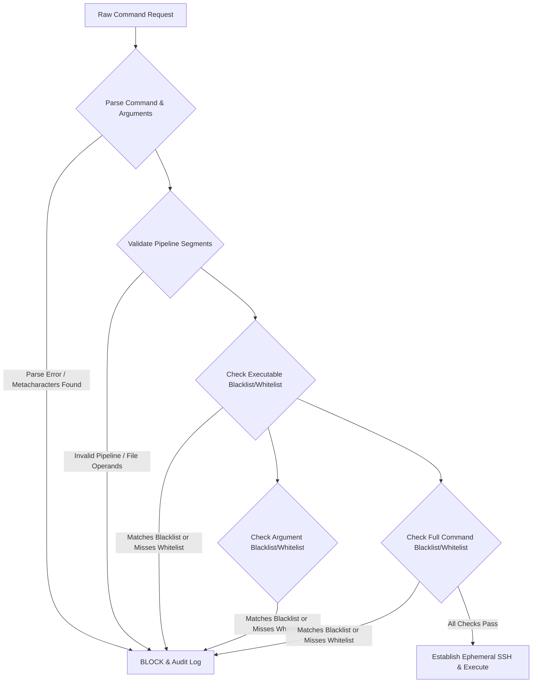

# Aegis Security Model & Hardening Guide

Aegis is an MCP-native (Model Context Protocol) SSH bridge designed to allow AI agents to run approved commands on Linux hosts safely. It acts as an **intermediary gateway** rather than a remote shell environment. 

This document details the defense-in-depth security model of Aegis, how its validation engine prevents command injection, and why the runtime container environment is hardened using a minimal, shell-less distroless image.

---

## 1. Threat Model & Boundaries

Aegis enforces multiple clear trust boundaries to isolate clients, the gateway itself, and the remote hosts.

```text
+-------------------+
|   AI Agent/LLM    |
+---------+---------+
          |
          | Boundary 1: API Token + TLS (SSE)
          v
+-------------------+
|   Aegis Gateway   | <-- Hardened Distroless Sandbox (Boundary 3)
+---------+---------+
          |
          | Boundary 2: SSH Key + Host Key Pinning
          v
+-------------------+
| Remote Linux Host | <-- OS-level Permissions & sudo Policies (Boundary 4)
+-------------------+
```

### Boundary 1: Client to Aegis Gateway
- **Authentication**: Access to Aegis SSE (Server-Sent Events) endpoints requires a Bearer Authorization Token configured in `api_keys` on a per-host basis. 
- **Encryption**: Transport security (HTTPS/TLS) is strongly recommended for production environments using standard certificates placed in `/certs` or managed via an upstream reverse proxy.
- **Tenant Isolation**: Each host configuration file behaves as a separate endpoint and authentication boundary. An API key for one host alias cannot access or execute commands on another.

### Boundary 2: Aegis to Remote Host
- **Authentication**: Aegis connects using standard, secure SSH protocols with strong authentication (Ed25519/RSA private keys or password auth).
- **Host Key Pinning**: Aegis supports pinning the remote host key fingerprint (`host_key_fingerprint`). If set, the connection is immediately aborted if the host key changes, preventing Man-in-the-Middle (MitM) attacks.
- **Credential Protection**: Private keys are kept strictly in the host's `/keys` mount and are never exposed to the client or the AI.

### Boundary 3: Aegis Container Sandbox
- **Minimal Footprint**: The Aegis service runs inside a highly restricted, shell-less distroless container.
- **Execution Level**: The container runtime does not run as `root` (uses UID/GID `65532:65532`).
- **No Local Tools**: No shells (`sh`, `bash`), package managers (`apt`), or networking tools (`curl`, `wget`) are present.

### Boundary 4: Remote Linux Target
- Aegis is a **bridge**, not a sandbox. Security boundaries on the target host are enforced by native Linux security mechanisms:
  - The login shell/account permissions.
  - Sudoer configuration (`/etc/sudoers`).
  - Standard file permission masks (chmod/chown).
  - Audit logging (`auditd` or `journald`).
- Under the least-privilege model, you should configure a dedicated, restricted SSH user on the target host that only has access to the exact binaries they need to run (e.g., via specialized sudo permissions).

---

## 2. Command Validation Engine

The Aegis validation engine applies a strict multi-layer defense to examine every command before establishing an SSH connection. If any layer fails, the command is blocked, and the attempt is logged.



### Layer A: AST Parsing & Shell Feature Rejection
Before running any checks, Aegis parses the command string into an executable and an array of individual arguments. During this parsing phase, Aegis strictly rejects shell-control metacharacters that allow command chaining, redirection, or expansion:
- **No Command Chaining**: Semicolons (`;`), logical AND (`&&`), and logical OR (`||`) are rejected.
- **No Redirects**: Input and output redirection characters (`>`, `>>`, `<`) are completely blocked.
- **No Sub-Shells**: Command substitution using backticks (`` ` ``) or sub-shell syntax (`$(...)`) is blocked.
- **No Wildcard Expansions**: Characters such as asterisks (`*`) or question marks (`?`) are examined and heavily restricted to prevent directory traversal or glob injection.

### Layer B: Pipeline Filter Restriction
While standard shell piping (`|`) is generally unsafe because it allows arbitrary command execution, Aegis provides a **safe pipeline validation engine**. The engine only permits standard piping if every subsequent segment is on a pre-approved list of pure data-formatting utilities:
- Allowed pipeline filters: `grep`, `head`, `tail`, `sort`, `uniq`, `wc`, `cut`, and `tr`.
- **Strict Operand Rules**: To prevent an agent from reading arbitrary files using pipeline filters (e.g., `some_command | grep "secret" /etc/passwd`), the validator ensures that pipeline segments **only read from standard input (stdin)**. Any file path operand passed to a pipeline filter causes an immediate rejection.
- **Option Constraints**: Every allowed pipeline filter has a strict list of allowed flags. For example, `tail` can only use options such as `-n` or `-c`; any dangerous flags will trigger a validation block.

### Layer C: Regex Validation Matrices
Once the command is parsed, Aegis evaluates it against the assigned **Rule Profile** from the `rules/` directory. Each profile contains several regex validation arrays:

1. **Executable Whitelist/Blacklist**: Matches the base executable name (e.g., `^ls$`, `^docker$`).
2. **Arguments Whitelist/Blacklist**: Evaluates the normalized space-separated argument list.
3. **Full Command Whitelist/Blacklist**: Evaluates the entire normalized command string.

If whitelists are configured, the command **must match** at least one pattern to proceed. If the command matches any blacklist pattern, it is **blocked immediately**.

---

## 3. Hardened Distroless ("Scratch") Environment

The Aegis container image is built to provide maximum containment. It relies on a two-stage build process resulting in an ultra-hardened environment:

```dockerfile
# Stage 1: Build static Go binary
FROM golang:1.23-alpine AS builder
...
RUN CGO_ENABLED=0 go build -ldflags="-w -s -extldflags=-static" ...

# Stage 2: Distroless static runtime
FROM gcr.io/distroless/static-debian12:nonroot
COPY --from=builder /out/aegis-ssh-mcp /usr/local/bin/aegis-ssh-mcp
...
USER nonroot
ENTRYPOINT ["/usr/local/bin/aegis-ssh-mcp"]
```

### Why we use Distroless Static
Standard container images (like Ubuntu or Alpine) contain rich operating systems with shells, system package managers, and networking clients. If a vulnerability is found in the application, an attacker can use these local tools to explore, expand privileges, or escape the container.

Aegis mitigates this threat entirely by using `gcr.io/distroless/static-debian12:nonroot`:

- **Zero Shells Available**: There is no `/bin/sh`, `/bin/bash`, `/bin/ash`, or other shell utilities inside the container. Even if an attacker achieves Remote Code Execution (RCE) via a memory or dependency vulnerability, they cannot execute shell scripts or commands locally in the container.
- **No Utilities**: There are no package managers (`apt`, `apk`), downloaders (`curl`, `wget`), or networking tools (`nc`, `telnet`). An attacker cannot download malicious payloads or easily scan your local subnet from the container.
- **Non-Root Execution**: The container runs under the default `nonroot` user (UID `65532`). Even if a container-escape vulnerability exists in the virtualization layer, it is significantly harder to exploit when starting from a low-privilege non-root account.
- **Immutable Bind Mounts**: Configurations and rules are typically bind-mounted read-only into the container (`/configs` and `/rules`), preventing modifications from within the runtime environment.

---

## 4. Ephemeral SSH Lifecycles

A common security vulnerability in remote agent interfaces is the use of persistent SSH connections, background `screen`/`tmux` sessions, or interactive pseudo-TTYs (PTYs). These persistent sessions allow agents (or attackers) to retain state, execute background commands, and hide malicious activity from direct auditing.

Aegis mandates an **ephemeral lifecycle** for every command:

1. **One Request, One Session**: For every incoming tool execution, Aegis establishes a completely new SSH connection and opens a single, non-interactive execution channel.
2. **Standard I/O Channel**: Aegis runs the validated command directly using the target user's standard non-interactive command execution path (equivalent to running `ssh user@host "command"`).
3. **Immediate Disconnect**: The moment the command finishes, standard output (stdout) and standard error (stderr) are captured, the SSH session is completely torn down, and the connection is closed.
4. **No Pseudo-TTYs**: Pseudo-terminal allocations are disabled by default. This makes it impossible for interactive prompts, password fields, or hidden background tasks to stay open in the background.

---

## 5. Audit Logging & Sensitive Data Redaction

Comprehensive auditing and data isolation are critical for ensuring accountability.

### Structured Audit Logs
Aegis logs all validation decisions to standard error (stderr), which are normally captured by standard container log collectors (e.g., Docker, Vector, or CloudWatch):
- Logs include: timestamp, client IP, host alias, executable name, raw command, validation decision (Passed/Blocked), and validation failure reasons.
- Highly useful for detecting malicious intent, tuning whitelists, or reviewing agent actions.

### Output Redaction
To prevent sensitive information (such as database credentials, API keys, or private system keys) from being returned to the AI model or client, Aegis supports **regex-based output redaction**:
- Add `"redaction_enabled": true` and `"redaction_patterns": ["regex1", "regex2"]` to a host configuration file.
- Any output matching the regex list is automatically replaced with `[REDACTED]` before being transmitted back to the MCP client.
